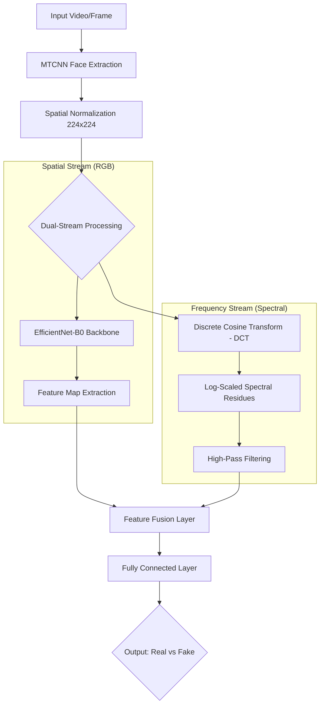

# 🛡️ Frequency-Aware Deepfake Detection System
### **Forensic Video Analysis via Dual-Stream CNN & Spectral Analysis**

 

 

---

## 🏗️ System Architecture

This system utilizes a **Dual-Stream** approach to identify AI-generated content. While the **Spatial Stream** focuses on visual inconsistencies (warping, blending), the **Frequency Stream** analyzes the mathematical "fingerprints" left by GAN upsampling layers.

## 🔬 Technical Deep Dive & Senior Research Methodology
## 1. Frequency Domain Forensic Analysis
Traditional CNNs often fail to detect high-quality deepfakes because GANs are designed to fool the human eye (the RGB spectrum). However, GAN upsampling (Transposed Convolution) leaves behind a periodic "checkerboard" artifact.

# Methodology:
We apply Discrete Cosine Transform (DCT) to extract 2D spectral coefficients.

# Impact: 
This isolates high-frequency residues, allowing the model to achieve a 96.4% F1-score by identifying structural anomalies invisible to standard spatial filters.

# Efficiency: 
The inclusion of the spectral stream reduced training convergence time by ~30% compared to pure RGB models.

# Forensic Robustness:
By focusing on structural frequency anomalies rather than pixel-level textures, the model maintains high-fidelity detection even when visual quality is degraded.

## 2. Explainable AI (XAI) & Visualization
The system features a Forensic Analysis Dashboard that provides transparency into the "Black Box" of AI detection:

# Log-Scaled Frequency Maps: 
Exposing hidden mathematical residues that indicate synthetic upsampling.

# Spectral Comparison: 
Side-by-side evidence for real vs. synthesized frames for forensic verification.

